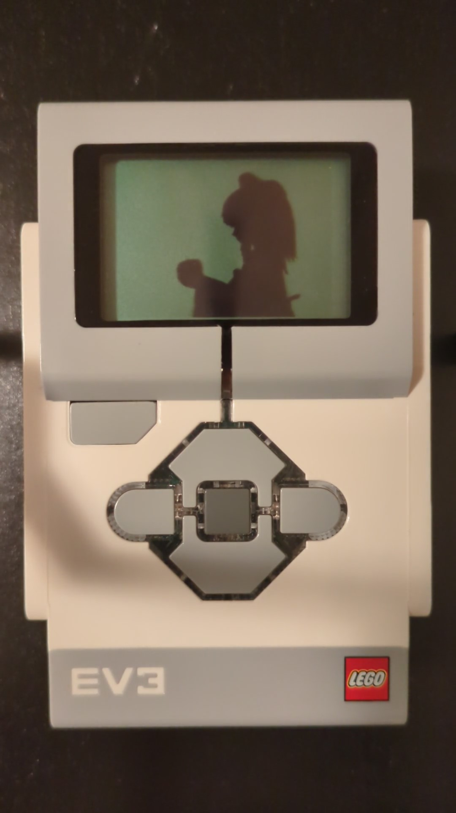

# bad-apple-ev3
My attempt at playing [Bad Apple!!](https://en.wikipedia.org/wiki/Bad_Apple!!#Use_as_a_graphical_and_audio_test) on LEGO MINDSTORMS EV3.

This was a side project that I completed while working on [roundabot](https://github.com/ObjectOops/roundabot).  
There are other implementations online with ostensibly higher framerates (I didn't measure them), but if I revisit this in the future some thing to consider would be:
- Using a raw image format instead of PNGs.
- Combining all frames into one file.
- Using C.
- Interfacing directly with the video driver's frame buffer interface.

The concept branch currently contains an untested concept that uses PWM to play notes.
